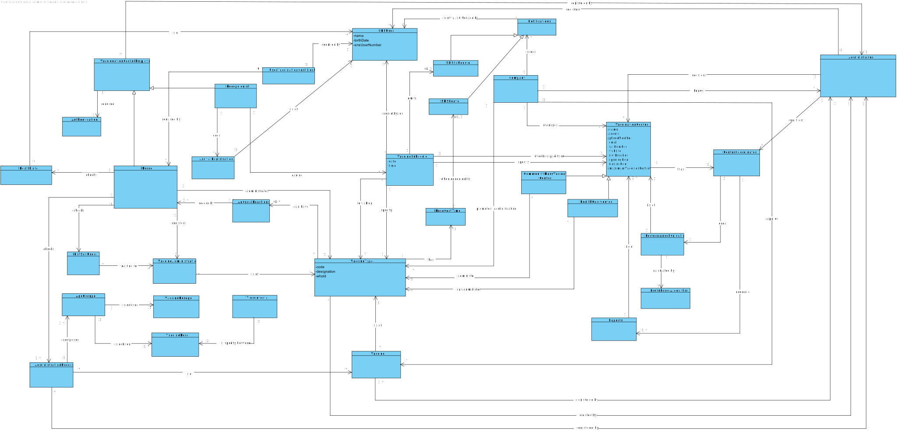

# OO Analysis #

The construction process of the domain model is based on the client specifications, especially the nouns (for _concepts_) and verbs (for _relations_) used. 

## Rationale to identify domain conceptual classes ##
To identify domain conceptual classes, start by making a list of candidate conceptual classes inspired by the list of categories suggested in the book "Applying UML and Patterns: An Introduction to Object-Oriented Analysis and Design and Iterative Development". 

### _Conceptual Class Category List_ ###

**Business Transactions**

Vaccine Administration

---

**Transaction Line Items**

*

---

**Product/Service related to a Transaction or Transaction Line Item**

Vaccine, Vaccination Certificate, SMS Schedule, SMS Leave Notification

---

**Transaction Records**

*  

---  

**Roles of People or Organizations**

SNS User, Receptionist, Nurse, Administrator, Center Coordinator

---

**Places**

Community Mass Vaccination Center, Health Care Center  

---

**Noteworthy Events**

Vaccine Schedule, Vaccine Administration, Arrival Registration, Administration Process, Performance Evaluation

---

**Physical Objects**

Vaccination Certificate

*

---

**Descriptions of Things**

Types of vaccine, User Info, Adverse Reactions, List of SNS users, Age Groups, Vaccine doses,
Vaccine Dosage, Time Interval  

---

**Catalogs**

*  

---

**Containers**

*  

---

**Elements of Containers**

*  

---

**Organizations**

DGS (Company), WHO, AGES, ARS 

---

**Other External/Collaborating Systems**

*  

---

**Records of finance, work, contracts, legal matters**

* 

---

**Financial Instruments**

*  

---

**Documents mentioned/used to perform some work/**

Vaccination Certificate 
---

###**Rationale to identify associations between conceptual classes**###

An association is a relationship between instances of objects that indicates a relevant connection and that is worth of remembering, or it is derivable from the List of Common Associations: 

+ **_A_** is physically or logically part of **_B_**
+ **_A_** is physically or logically contained in/on **_B_**
+ **_A_** is a description for **_B_**
+ **_A_** known/logged/recorded/reported/captured in **_B_**
+ **_A_** uses or manages or owns **_B_**
+ **_A_** is related with a transaction (item) of **_B_**
+ etc.

| Concept (A) 		                 |     Association   	     |                             Concept (B) |
|--------------------------------|:-----------------------:|----------------------------------------:|
| Company                        |         manages         |                       VaccinationCenter |
| Company                        |         applies         |                                 Vaccine |
| Company                        |          knows          |                           Administrator |
| Company                        | promotes administration |                             VaccineType |
| Company                        |          sends          |                           Notifications |
| CommunityMassVaccinationCenter |          is  a          |                       VaccinationCenter |
| Health Care Center             |          is a           |                       VaccinationCenter |
| VaccinationCenter              |          has 	          |                       CenterCoordinator |
| CenterCoordinator              |          does	          |                   PerformanceEvaluation |
| HealthCareCenter 	             |     can administer      |                      	VaccineType (any) |
| CommunityMassVaccinationCenter |       administer        |                   	VaccineType (single) |
| Vaccine                        |          is of          |                            	VaccineType |
| VaccineType                    |       	created by       |                          	Administrator |
| VaccineType                    |        	can have        |                        AdverseReactions |
| VaccineType                    |       	created by       |                          	Administrator |
| VaccineType                    |           has           |                            RecoveryTime |
| VaccineSchedule                |     	created by/for     |                                SNS User |
| VaccineSchedule                |       	for taking       |                             VaccineType |
| VaccineSchedule                |         specify         |                       VaccinationCenter |
| VaccineSchedule                |         specify         |                             VaccineType |
| VaccinationCertificate         |       required by       |                                SNS user |
| VaccinationCertificate         |       required by       | Nurse (that work in healthcare centers) |
| Administrator                  |        registers        |                               SNS users |
| Administrator                  |        registers        |                         CompanyEmployee |
| Administrator                  |         specify         |                             VaccineType |
| Administrator                  |        registers        |       Vaccine and AdministrationProcess |
| Administrator                  |        registers        |                      VaccinationCenters |
| CompanyEmployee                |           has           |                     Center Coordinators |
| CompanyEmployee                |          works          |                           Receptionists |
| CompanyEmployee                |           has           |                                  Nurses |
| CompanyEmployee                |           has           |                       VaccinationCenter |
| Receptionist                   |          does           |                     ArrivalRegistration |
| Receptionist                   |         can do          |                         VaccineSchedule |
| Receptionist                   |          is a           |               VaccinationCenterEmployee |
| ArrivalRegistration            |          is of          |                                 SnsUser |
| Nurse                          |          is a           |               VaccinationCenterEmployee |
| Nurse                          |         checks          |                            ListSnsUsers |
| Nurse                          |         checks          |                              HealthInfo |
| Nurse                          |      administrates      |                             VaccineType |
| Nurse                          |         checks          |                   AdministrationProcess |
| AdministrationProcess          |        comprises        |                                AgeGroup |
| AgeGroups                      |       is defined        |                           VaccineDosage |
| AgeGroups                      |       is defined        |                            VaccineDoses |
| TimeInterval                   |   is specify between    |                            VaccineDoses |
| Nurse                          |        registers        |                   VaccineAdministration |
| VaccineAdministration          |          is of          |                             VaccineType |
| ListSNSUsers                   |       waiting for       |                   VaccineAdministration |
| AdverseReactions               |        record by        |                                   Nurse |
| AdministrationProcess          |          is of          |                                 vaccine |
| AdministrationProcess          |        comprises        |                                AgeGroup |
| HealthInfo                     |          if of          |                                 SNSUser |
| SNSUser                        |        receives         |                             VaccineType |
| SNSUser                        |       authorizes        |                             SmsSchedule |
| SNSUser                        |        receives         |                           Notifications |
| CenterCoordinator              |          does           |                   PerformanceEvaluation |
| SmsSchedule                    |          is a           |                            Notification |
| SmsLeave                       |          is a           |                            Notification |
| Notification                   | send to/ authorized by  |                                 SnsUser |
| RecoveryTime                   |    when ended emits     |                                SmsLeave |
| PerformanceEvaluation          |      calculated by      |                     BruteForceAlgorithm |
| ...  	                         |       ...    		 	       |                                     ... |

## Domain Model

**Do NOT forget to identify concepts atributes too.**

**Insert below the Domain Model Diagram in a SVG format**

