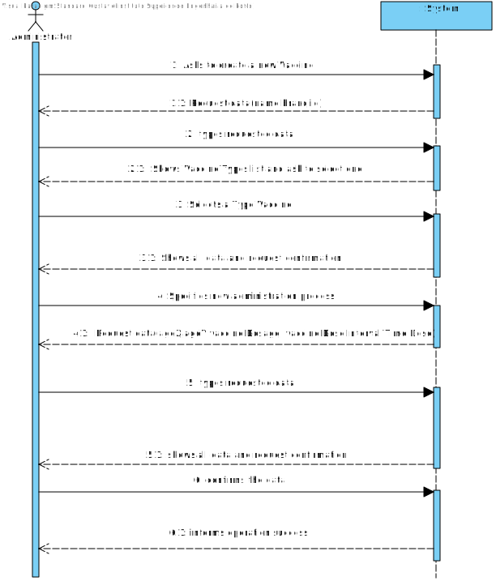
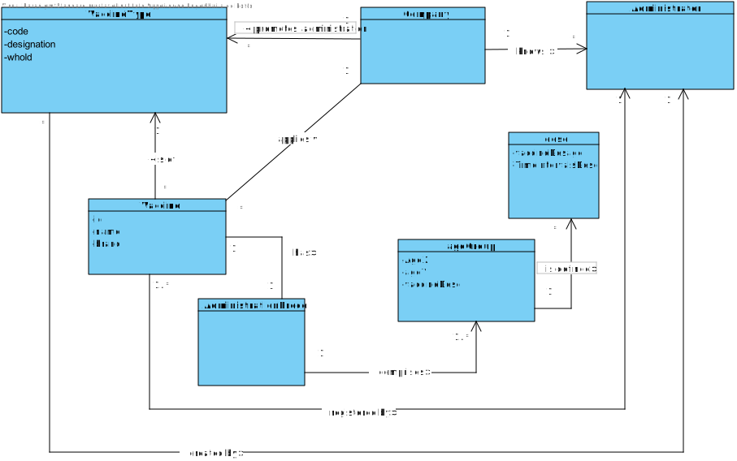
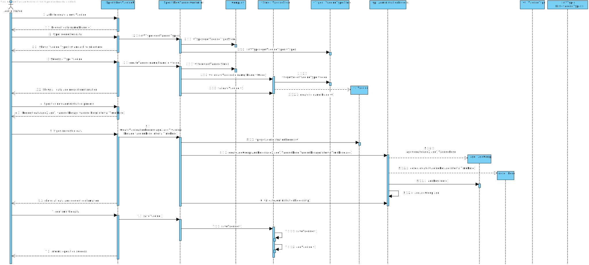
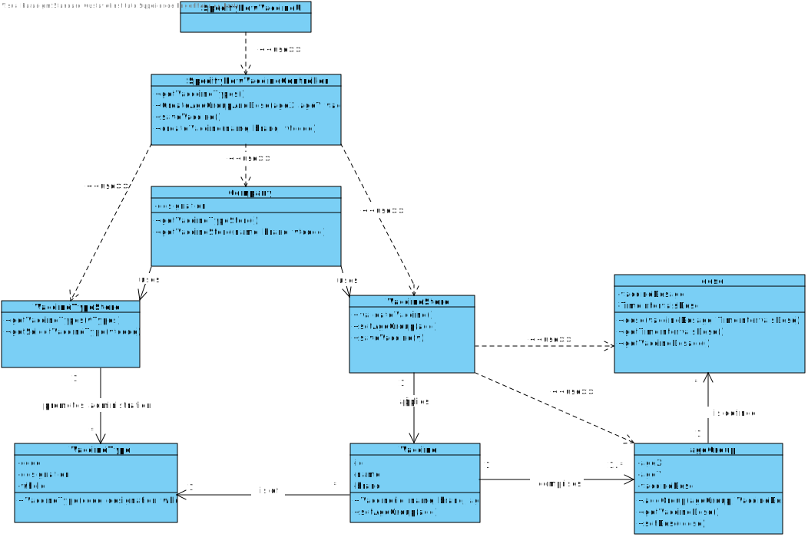

# US 0013 - to specify a new vaccine and its administration process.

## 1. Requirements Engineering

### 1.1. User Story Description

*As an administrator, I want to specify a new parameter category.*

### 1.2. Customer Specifications and Clarifications 

####From the Specifications Document:

>“[...]  it is worth noticing that for each type of vaccine, several vaccines might exist, each one
demanding a distinct administration process [...]"

>"[...]An Administrator is responsible for properly configuring and managing the core information (e.g.:
type of vaccines, vaccines, vaccination centers, employees)[...]"

>“[…] for each type of vaccine, it might exist several vaccines  […]”
### 1.3. Acceptance Criteria

Omitted / Not Provided.

### 1.4. Found out Dependencies

There is a dependency to "US012 to specify a new vaccine type" since at least a vaccine type must exist to classify the vaccine being created.

### 1.5 Input and Output Data

**Input Data:**

* Typed data:
    * name
    * brand
    * id
    * AgeX
    * AgeY
    * Vaccine dosage
    * Vaccine Dose 
    * Interval Time Dose

* Selected data:
   * Classifying vaccines Type

**Output Data:**

* List of existing Vaccine Type
* (In)Success of the operation

### 1.6. System Sequence Diagram (SSD)

### 1.7 Other Relevant Remarks

*Use this section to capture other relevant information that is related with this US such as (i) special requirements ; (ii) data and/or technology variations; (iii) how often this US is held.* 

## 2. OO Analysis

### 2.1. Relevant Domain Model Excerpt 
*In this section, it is suggested to present an excerpt of the domain model that is seen as relevant to fulfill this requirement.* 

### 2.2. Other Remarks

*Use this section to capture some aditional notes/remarks that must be taken into consideration into the design activity. In some case, it might be usefull to add other analysis artifacts (e.g. activity or state diagrams).* 

## 3. Design - User Story Realization 

### 3.1. Rationale

**The rationale grounds on the SSD interactions and the identified input/output data.**

| Interaction ID                                                                    | Question: Which class is responsible for... | Answer                 | Justification (with patterns)                       |
|:----------------------------------------------------------------------------------|:--------------------------------------------|:-----------------------|:----------------------------------------------------|
| Step 1:Asks to create a new Vaccine                                               | ... instantiating a new vaccine?            | VaccineStore           | Creator: R1/2                                       |
| Step 1.1: Request data(name,brand)                                                | n/a                                         |                        |                                                     |
| Step 2: types requested data                                                      | ...saving the input data?                   | VaccineStore           | IE: The object created in step 1 has its own data.  |
| Step 2.1: Shows Vaccine Types list and ask to select one                          | ... showing a list of vaccine types         | Company                | IE: uses its vaccineStore                           |
| Step 3: Selects a Type Vaccine                                                    | ... Saving The select vaccineType?          | UI                     | IE: responsible for user interaction                |
| Step 3.1:Shows all data and request confirmation                                  | ...  … validating the data locally?         | Vaccine                | IE: Stored data in the vaccine                      |
| Step 4:  Specifies new administration process                                     | ... Specifies the Administration process    | AdministrationProcess  | IE: Specifies administration in the vaccine created |
| Step 4.1: Request data(ageX,ageY,vaccine Dosage, vaccine Dose,Interval Time Dose) | n/a                                         |                        |                                                     |
| Step 5:  types requested data                                                     | ...saving the input data?                   | Administration Process | IE: Stored data in the vaccine created              |
| Step 5.1: shows all data and request confirmation                                 | … validating the data locally?              | AdministrationProcess  | IE: knows its own data.                             |
|                                                                                   | validating the data globally?               | VaccineStore           | IE: knows all the Vaccine objects                   |
| Step 6: confirms the data                                                         | Saving the created vaccine?                 | VaccineStore           | IE:adopts/records all the vaccine objects           |
| Step 6.1: informs operation success                                               | informing operation sucess?                 | UI                     | IE: resposible for user interaction                 |

### Systematization ##

According to the taken rationale, the conceptual classes promoted to software classes are: 

 * Company
 * VaccineStore
 * Vaccine
 * AdministrationProcess

Other software classes (i.e. Pure Fabrication) identified: 
 * SpecifyNewVaccineUI  
 * SpecifyNewVaccineController

## 3.2. Sequence Diagram (SD)

*In this section, it is suggested to present an UML dynamic view stating the sequence of domain related software objects' interactions that allows to fulfill the requirement.* 

## 3.3. Class Diagram (CD)

*In this section, it is suggested to present an UML static view representing the main domain related software classes that are involved in fulfilling the requirement as well as and their relations, attributes and methods.*

# 4. Tests 
*In this section, it is suggested to systematize how the tests were designed to allow a correct measurement of requirements fulfilling.* 

**_DO NOT COPY ALL DEVELOPED TESTS HERE_**

**Test 1:** Check that it is not possible to create an instance of the Example class with null values. 

	@Test(expected = IllegalArgumentException.class)
		public void ensureNullIsNotAllowed() {
		Exemplo instance = new Exemplo(null, null);
	}

*It is also recommended to organize this content by subsections.* 

# 5. Construction (Implementation)

*In this section, it is suggested to provide, if necessary, some evidence that the construction/implementation is in accordance with the previously carried out design. Furthermore, it is recommeded to mention/describe the existence of other relevant (e.g. configuration) files and highlight relevant commits.*

*It is also recommended to organize this content by subsections.* 

# 6. Integration and Demo 

*In this section, it is suggested to describe the efforts made to integrate this functionality with the other features of the system.*

# 7. Observations

*In this section, it is suggested to present a critical perspective on the developed work, pointing, for example, to other alternatives and or future related work.*

