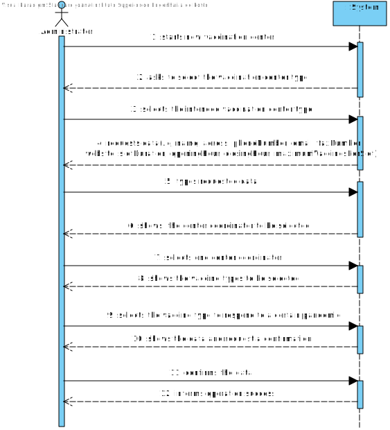
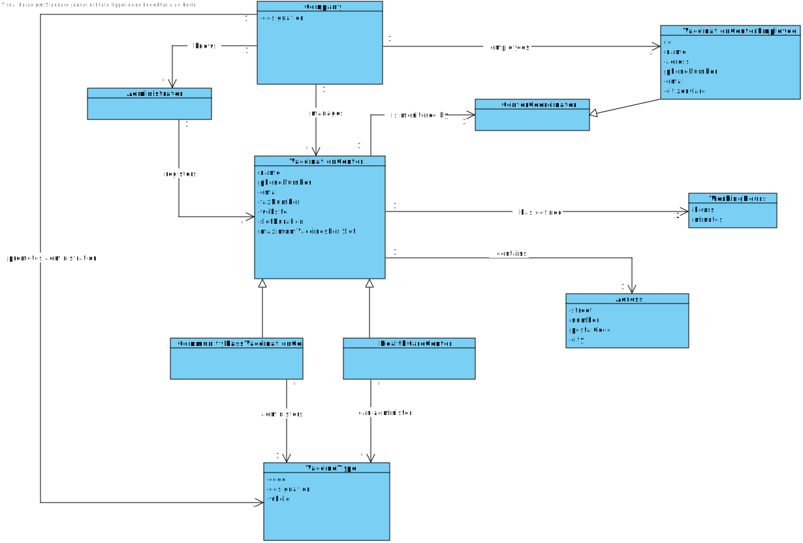
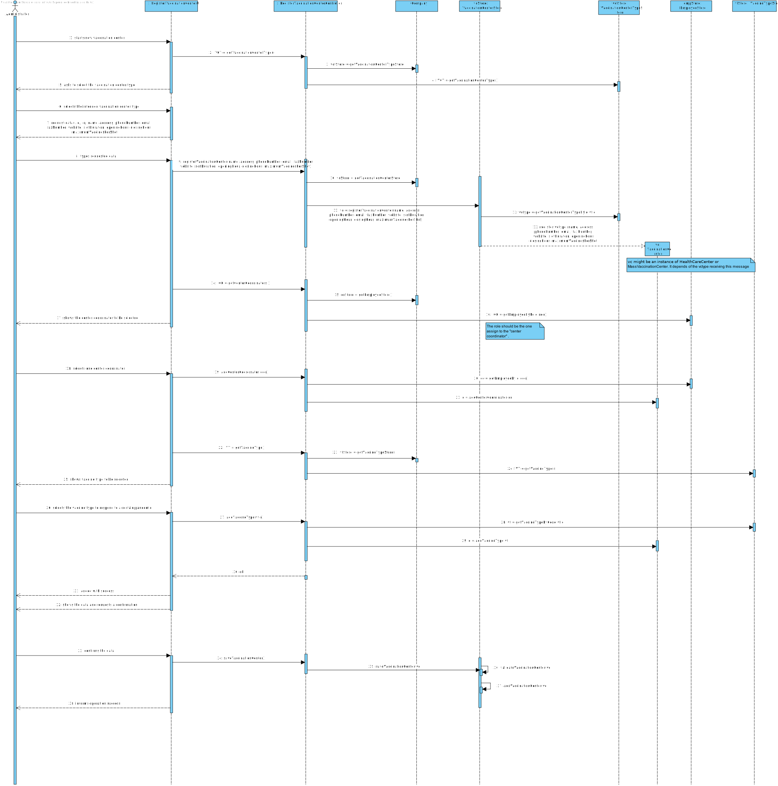
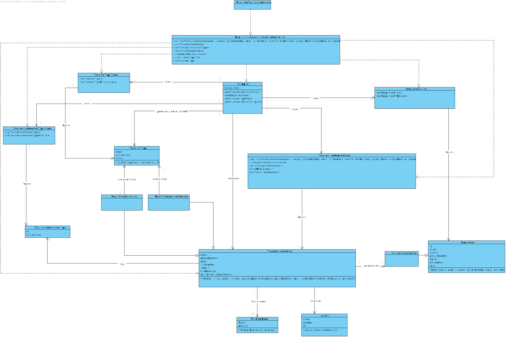

# US009 - Register a vaccination center to respond to a certain pandemic

## 1. Requirements Engineering

In this section, it is suggested to capture the requirement description and specifications as provided by the client as well as any further clarification on it. It is also suggested to capture the requirements acceptance criteria and existing dependencies to other requirements. At last, identify the involved input and output data and depicted an Actor-System interaction in order to fulfill the requirement.*

### 1.1. User Story Description

*As an administrator, I want to register a vaccination center to respond to a certain pandemic.*

### 1.2. Customer Specifications and Clarifications 
**From the Specifications Document**

"The DGS vaccination process is mainly carried out through community mass vaccination centers and health care centers across the country."

"Different from the health care centers, which provide a wide range of healthcare services to citizens to a certain area, the community mass vacccination centers are facilities specifically created to administer vaccines of a single type as response to an ongoing disease outbreak."

"The main difference between the two kinds of centers is that health care center is associated with a given ARS and AGES, and it can administer any type of vaccines"

"Both kinds of vaccination centers are characterized by a name, and address, a phone number, an e-mail addres, a fax number, a website address, opening and closing hours, slot duratiion (e.g.: 5 minutes) and the maximum number of vaccines that can be given per slot (e.g.: 10 vaccines per slot).). In addition,
each vaccination center has one coordinator"

"Each vaccination center has a Center Coordinator that has the responsibility to manage the Covid19 vaccination process."

### 1.3. Acceptance Criteria

*No acceptance criteria has been defined*

### 1.4. Found out Dependencies

*User Stories dependencies: US010 and US012*

### 1.5 Input and Output Data

*Identity here the data to be inputted by the system actor as well as the output data that the system have/needs to present in order to properly support the actor actions. Regarding the inputted data, it is suggested to distinguish between typed data and selected data (e.g. from a list)*

**Input Data**

• Typed data: *name, adress, phone number, email, fax number, website adress, opening hours, closing hours, slot duration, maximum number of vaccines per slot*

• Selected data: *vaccineCenterType, centerCoordinator, vaccineType*

**Output Data**

• *(In)Success of the operation*

### 1.6. System Sequence Diagram (SSD)

*Insert here a SSD depicting the envisioned Actor-System interactions and throughout which data is inputted and outputted to fulfill the requirement. All interactions must be numbered.*

### 1.7 Other Relevant Remarks

*Use this section to capture other relevant information that is related with this US such as (i) special requirements ; (ii) data and/or technology variations; (iii) how often this US is held.* 

## 2. OO Analysis

### 2.1. Relevant Domain Model Excerpt 
*In this section, it is suggested to present an excerpt of the domain model that is seen as relevant to fulfill this requirement.*

### 2.2. Other Remarks

*Use this section to capture some aditional notes/remarks that must be taken into consideration into the design activity. In some case, it might be usefull to add other analysis artifacts (e.g. activity or state diagrams).* 

## 3. Design - User Story Realization 

### 3.1. Rationale

**The rationale grounds on the SSD interactions and the identified input/output data.**

| Interaction ID                                                                                                                                  | Question: Which class is responsible for...                                                                             | Answer                              | Justification (with patterns)                                                                                   |
|:------------------------------------------------------------------------------------------------------------------------------------------------|:------------------------------------------------------------------------------------------------------------------------|:------------------------------------|:----------------------------------------------------------------------------------------------------------------|
| Step 1: starts registering a vaccination center		                                                                                               | 					...instanciation a new vaccination center?	                                                                        | Company                             | Creator: R1/2                                                                                                   |
| Step 2: request vaccination center type (i.e name, id)                                                                                          | 							 ...getting vaccination center types?                                                                            | Company                             | IE: Company knows all vaccination center types                                                                  |
| Step 3: selects vaccination center type		                                                                                                       | ...saving the input data?							                                                                                        | VaccinationCenter                   | IE: The object created in step 1 has its own data                                                               |
| Step 4: request data (i.e name, adress, phoneNumber, email, faxNumber, website, slotDuration, openingHour, closingHour, maximumVaccinesPerSlot) | 							 n/a                                                                                                             |                                     |                                                                                                                 |
| Step 5: types requested data		                                                                                                                  | ...saving the input data?							                                                                                        | VaccinationCenter                   | IE: The object created in step 1 has its own data                                                               |
| Step 6: request center coordinator (i.e name, id)                                                                                               | 							 ...getting center coordinators?                                                                                 | Company                             | IE: Company knows all center coordinators                                                                       |
| Step 7: selects center coordinator		                                                                                                            | ...saving the input data?							                                                                                        | VaccinationCenter                   | IE: The object created in step 1 has its own data                                                               |
| Step 8: request vaccine type (i.e name, id)                                                                                                     | 							 ...getting vaccine types?                                                                                       | Company                             | IE: Company knows all vaccine types                                                                             |
| Step 9: selects vaccine type		                                                                                                                  | ...saving the input data?							                                                                                        | VaccinationCenter                   | IE: The object created in step 1 has its own data                                                               |
| Step 10: shows the data and requests a confirmation  		                                                                                         | 	...validating the data locally (e.g. mandatory vs. non mandatory data)?	   ...validating the data globally?					 | VaccinationCenter     Company | IE: The object created in step 1 has its own data     IE: Company knows all the VaccinationCenter objects |
| Step 11: confirms the data		                                                                                                                    | ...saving the created vaccination center?                                                                               | 				Company			                      | IE: adopts/records all the VaccinationCenter objects                                                            |                                                   |
| Step 12: informs that operation success 		                                                                                                      | ...informing operation success?							                                                                                  | UI                                  | IE: responsible for user interaction                                                                            |                                                                                                                                                              | 							                                                                                                                 |                                     |                                                                                                                 |  

### Systematization ##

According to the taken rationale, the conceptual classes promoted to software classes are: 

 * Company
 * VaccinationCenter (HealthCareCenter or MassVaccinationCenter)

Other software classes (i.e. Pure Fabrication) identified: 
 * RegisterVaccinationCenterUI  
 * RegisterVaccinationCenterController

## 3.2. Sequence Diagram (SD)

*In this section, it is suggested to present an UML dynamic view stating the sequence of domain related software objects' interactions that allows to fulfill the requirement.* 

## 3.3. Class Diagram (CD)

*In this section, it is suggested to present an UML static view representing the main domain related software classes that are involved in fulfilling the requirement as well as and their relations, attributes and methods.*

# 4. Tests 
*In this section, it is suggested to systematize how the tests were designed to allow a correct measurement of requirements fulfilling.* 

**_DO NOT COPY ALL DEVELOPED TESTS HERE_**

**Test 1:** Check that it is not possible to create an instance of the Example class with null values. 

	@Test(expected = IllegalArgumentException.class)
		public void ensureNullIsNotAllowed() {
		Exemplo instance = new Exemplo(null, null);
	}

*It is also recommended to organize this content by subsections.* 

# 5. Construction (Implementation)

#### Controller

    package app.controller;
    public class RegisterVaccinationCenterController {

        public void saveVaccinationCenter(){}

        public void getVaccinationCenterTypes(){}

        public void getCenterCoordinators(){}

        public void addCenterCoordinator(int ccId){}

        public void addVaccineType(int code){}

        public void getVaccineType(){}
    }

#### Domain - Model

    package app.domain.model;
    public class Company {

	    public void getEmployeeStore(){}

        public void getVaccinationCenterStore(){}

        public void getVaccineTypeStore(){}

        public void getVaccinationCenterTypeStore(){}
    }

 

    package app.domain.model;
    import java.util.List;

    public class VaccinationCenterType {
        private int id;
        private String designation;

        private List<VaccinationCenterType> vaccinationCenterTypeList;
    }

 

    package app.domain.model;
    public class VaccineType {

        private String code;
        private String designation;
        private String whoId;

        public VaccineType (String code, String designation, String whoId) {}
    }

 

    package app.domain.model;
    public abstract class VaccinationCenter {
        private String name;
        private Address address;
        private int phoneNumber;
        private String email;
        private int faxNumber;
        private String website;
        private int slotDuration;
        private WorkingHour openingHour;
        private WorkingHour closingHour;
        private int maximumVaccinesPerSlot;
        private VaccinationCenterType vaccinationCenterType;
        private VaccineType vaccineType;

        private List<VaccinationCenter> vaccinationCenter;

        public VaccinationCenter (String name, Address address, int phoneNumber, String email, int faxNumber, String website, int slotDuration, WorkingHour openingHour, WorkingHour closingHour, int maximumVaccinesPerSlot, VaccinationCenterType vaccinationCenterType, VaccineType vaccineType){}
    }

 

    package app.domain.model;
    public class Address {
        private String street;
        private int number;
        private String city;

        public Address(String street, int number, String city){}
    }

 

    package app.domain.model;
    public class WorkingHour {

        private int hours;
        private int minutes;

        public WorkingHour(int hours, int minutes){}
    }

 

    package app.domain.model;

    public class MassVaccinationCenters extends VaccinationCenter{
    }

 

    package app.domain.model;

    public class HealthCareCenters extends VaccinationCenter{
    }

 

#### Domain - Store 

    package app.domain.store;
    public class VaccineTypeStore {

        public void getVaccineTypes(){}

        public void getVaccineTypeByCode(int code){}
    }

 

    package app.domain.store;
    public class EmployeeStore {
        public void getEmployeeById(int id){}

    public void getEmployeeByRole(int role){}
    }

 

    package app.domain.store;
    public class VaccinationCenterTypeStore {

        public void getVaccinationCenterTypes(){}

        public void getVaccinationCenterTypeById(int vtId){}

    }

 

    package app.domain.store;

    import app.domain.model.Address;
    import app.domain.model.VaccinationCenter;
    import app.domain.model.WorkingHour;

    public class VaccinationCenterStore {

        public void registerVaccinationCenter(String name, Address address, int phoneNumber, String email, int faxNumber, String website, int slotDuration, WorkingHour openingHour, WorkingHour closingHour, int maximumVaccinesPerShot){}

        public void validateVaccinationCenter(VaccinationCenter vc){}

        public void saveVaccinationCenter(VaccinationCenter vc){}

        private void checkDuplicates(VaccinationCenter vc){}

        private void addVaccinationCenter(VaccinationCenter vc){}

    }

 

# 6. Integration and Demo 

*In this section, it is suggested to describe the efforts made to integrate this functionality with the other features of the system.*

# 7. Observations

*In this section, it is suggested to present a critical perspective on the developed work, pointing, for example, to other alternatives and or future related work.*

