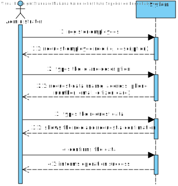
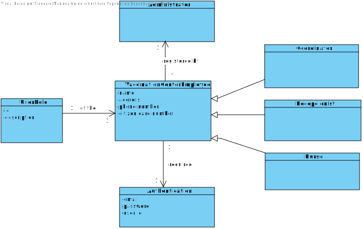
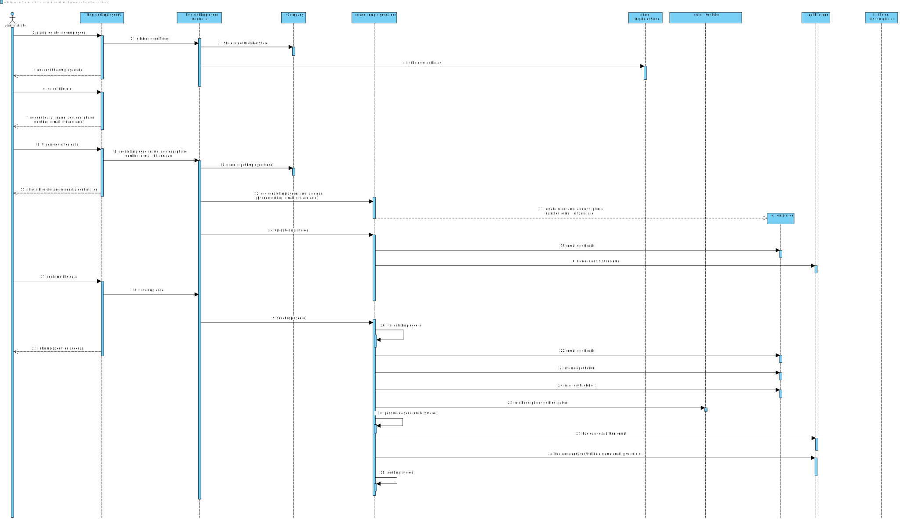
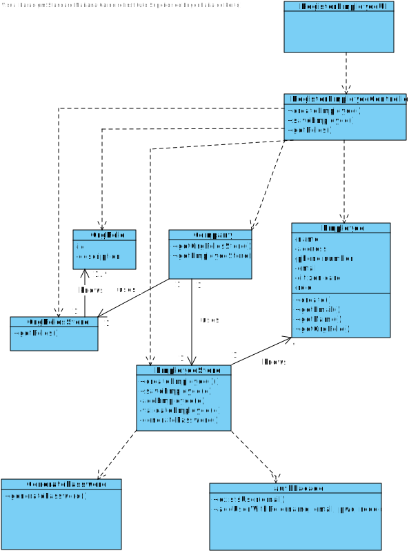

# US XXX - XXXX XXXX

## 1. Requirements Engineering

*In this section, it is suggested to capture the requirement description and specifications as provided by the client as well as any further clarification on it. It is also suggested to capture the requirements acceptance criteria and existing dependencies to other requirements. At last, identify the involved input and output data and depicted an Actor-System interaction in order to fulfill the requirement.*

### 1.1. User Story Description

*As an administrator, I want to register an Employee.*

### 1.2. Customer Specifications and Clarifications 

**From the Specifications Document:**

"Any Administrator uses the application to register centers, SNS users, center coordinators, receptionists, and nurses enrolled in the vaccination process."

**From the client clarifications:**

Question:

*"Besides a password and a user name, what other (if any) information should the Admin use to register a new employee? Are any of them optional?"*

Answer:

*Every Employee has only one role (Coordinator, Receptionist, Nurse).
Employee attributes: Id (automatic), Name, address, phone number, e-mail and Citizen Card 			number.
All attributes are mandatory.*

Question:

*"[1] What is the correct format for the employee's phone number and cc? Should we consider that these follow the portuguese format?
[2] Is the password generated automatically, or is it specified by the user operating the system?"*

Answer:

*1- Consider that these two attributes follow the portuguese format;*

*2- The password should be generated automatically.*

### 1.3. Acceptance Criteria

**AC1:** *password should have seven alphanumeric characters, including three capital letters and two digits.*

**AC2:** *only one role per employee*

**AC3:** *phone number with 9 digits and citzen card number with 8 digits.*

### 1.4. Found out Dependencies

*No dependencies were found.*

### 1.5 Input and Output Data

**Input Data**

• Typed data: *id, description, name, address, phone number, email, citizen card*

• Selected data: *(none)*

**Output Data**

• *(In)Success of the operation*

### 1.6. System Sequence Diagram (SSD)

*Insert here a SSD depicting the envisioned Actor-System interactions and throughout which data is inputted and outputted to fulfill the requirement. All interactions must be numbered.*

### 1.7 Other Relevant Remarks

*Use this section to capture other relevant information that is related with this US such as (i) special requirements ; (ii) data and/or technology variations; (iii) how often this US is held.* 

## 2. OO Analysis

### 2.1. Relevant Domain Model Excerpt 
*In this section, it is suggested to present an excerpt of the domain model that is seen as relevant to fulfill this requirement.* 

### 2.2. Other Remarks

*Use this section to capture some aditional notes/remarks that must be taken into consideration into the design activity. In some case, it might be usefull to add other analysis artifacts (e.g. activity or state diagrams).* 

## 3. Design - User Story Realization 

### 3.1. Rationale

**The rationale grounds on the SSD interactions and the identified input/output data.**

| Interaction ID | Question: Which class is responsible for... | Answer  | Justification (with patterns)  |
|:-------------  |:--------------------- |:------------|:---------------------------- |
| Step 1 : register employees|...instanciation a new employee| Company | Creator: R1/2|
| Step 2 : request employee role (id, description)|n/a|             | |
| Step 3 : types the id and description|...saving the input data? | OrgRolesStore|  IE: The object created in step 1 has its own data |
| Step 4 : request data (name, address, phone number, email, citizen card)|n/a| | |
| Step 5 : types the request data|...saving the input data?|   Employee | IE: The object created in step 1 has its own data |
| Step 6 : shows the role and request a confirmation|	...validating the data locally(e.g. mandatory vs. non mandatory data)?    ...validating the data globally?| OrgRolesStore           Company| IE: The object created in step 1 has its own data     IE: Company knows all the Employee objects                          |              
| Step 7 : confirms the data|...saving the created employee? |Company| IE: adopts/records all the Employee objects                             |
| Step 8 : informs operation success|...informing operation success? | UI            | IE: responsible for user interaction |
| Step 9  		 |							 |             |                              |
| Step 10  		 |							 |             |                              |  

### Systematization ##

According to the taken rationale, the conceptual classes promoted to software classes are: 

 * Employee
 * Company
 * OrgRole
 * authFacade

Other software classes (i.e. Pure Fabrication) identified: 

 * RegisterEmployeeUI  
 * RegisterEmployeeController
 * GeneratePassword
 * OrgRolesStore
 * EmployeeStore

## 3.2. Sequence Diagram (SD)

*In this section, it is suggested to present an UML dynamic view stating the sequence of domain related software objects' interactions that allows to fulfill the requirement.* 

## 3.3. Class Diagram (CD)

*In this section, it is suggested to present an UML static view representing the main domain related software classes that are involved in fulfilling the requirement as well as and their relations, attributes and methods.*

# 4. Tests 
*In this section, it is suggested to systematize how the tests were designed to allow a correct measurement of requirements fulfilling.* 

**_DO NOT COPY ALL DEVELOPED TESTS HERE_**

**Test 1:** Check that it is not possible to create an instance of the Example class with null values. 

	@Test(expected = IllegalArgumentException.class)
		public void ensureNullIsNotAllowed() {
		Exemplo instance = new Exemplo(null, null);
	}

*It is also recommended to organize this content by subsections.* 

# 5. Construction (Implementation)

*In this section, it is suggested to provide, if necessary, some evidence that the construction/implementation is in accordance with the previously carried out design. Furthermore, it is recommeded to mention/describe the existence of other relevant (e.g. configuration) files and highlight relevant commits.*

*It is also recommended to organize this content by subsections.* 

# 6. Integration and Demo 

*In this section, it is suggested to describe the efforts made to integrate this functionality with the other features of the system.*

# 7. Observations

*In this section, it is suggested to present a critical perspective on the developed work, pointing, for example, to other alternatives and or future related work.*

