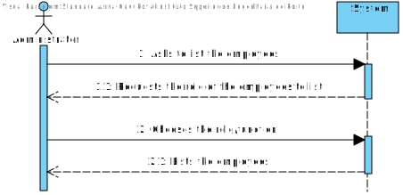
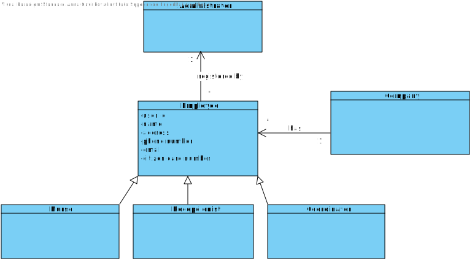
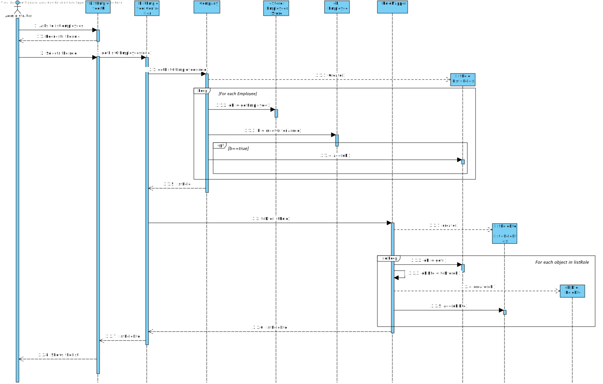
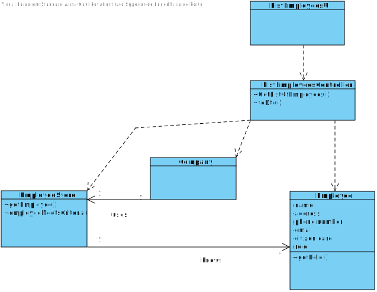

# US11 - List employees with a given role

## 1. Requirements Engineering

### 1.1. User Story Description

As an administrator I want to get a list of Employees with a given function/role

### 1.2. Customer Specifications and Clarifications 

**From the specifications document:**

An Administrator is responsible for properly configuring and managing the core information (e.g.: type of vaccines, vaccines, vaccination centers, **employees**) required for this application to be operated daily by SNS users, nurses, receptionists, etc.

**From the client clarifications:**

*Question:*

Should we give the user the possibility of listing employees from more than 1 role? Should the list be sorted in any specific way(for example alphabetical name order) or should we give the option to sort by other characteristics?

*Answer:*

1 - The Administrator should select a given role and all employees associated with the selected role should be listed. 
2 - For now I just want to get a list of employees without considering the order of presentation.

*Question:*

Besides the name of the employee, what other attributes do we need to show on the list? Can we show every single attribute, including password and username?

*Answer:*

The application should present all Employee attributes. 
Password is not an Employee attribute.

### 1.3. Acceptance Criteria

#####*none*

### 1.4. Found out Dependencies

• There is a dependency to "US10: register an Employee" because employees have to exist in order to be listed.

### 1.5 Input and Output Data

**Input data**

- Typed data

 - The role of employee

**Output data**

- List of employees

### 1.6. System Sequence Diagram (SSD)

### 1.7 Other Relevant Remarks

*Use this section to capture other relevant information that is related with this US such as (i) special requirements ; (ii) data and/or technology variations; (iii) how often this US is held.* 

## 2. OO Analysis

### 2.1. Relevant Domain Model Excerpt 

### 2.2. Other Remarks

*Use this section to capture some aditional notes/remarks that must be taken into consideration into the design activity. In some case, it might be usefull to add other analysis artifacts (e.g. activity or state diagrams).* 

## 3. Design - User Story Realization 

### 3.1. Rationale

**The rationale grounds on the SSD interactions and the identified input/output data.**

| Interaction ID | Question: Which class is responsible for... | Answer  | Justification (with patterns)  |
|:-------------  |:--------------------- |:------------|:---------------------------- |
| Asks to list employees  		 |	...interacting with the actor?						 |UI             |IE: is responsible for user interaction                              |
| Request the role  		 |	n/a						  |  n/a           |   n/a                           |
| Types requested role |	...sorting the employees by role?						 | EmployeesStore            | IE: knows all the employees                             |
| Shows the list  		 |	...showing the list of users?						 | UI            | IE: is responsible for user interaction                             |
| Step 5  		 |							 |             |                              |
| Step 6  		 |							 |             |                              |              
| Step 7  		 |							 |             |                              |
| Step 8  		 |							 |             |                              |
| Step 9  		 |							 |             |                              |
| Step 10  		 |							 |             |                              |  

### Systematization ##

According to the taken rationale, the conceptual classes promoted to software classes are: 

 * Company
 * Employee
 * Class3

Other software classes (i.e. Pure Fabrication) identified:

 - listEmployeesUI  
 - listEmployeesController  
 - employeesStore

## 3.2. Sequence Diagram (SD)

## 3.3. Class Diagram (CD)

# 4. Tests 
*In this section, it is suggested to systematize how the tests were designed to allow a correct measurement of requirements fulfilling.* 

**_DO NOT COPY ALL DEVELOPED TESTS HERE_**

**Test 1:** Check that it is not possible to create an instance of the Example class with null values. 

	@Test(expected = IllegalArgumentException.class)
		public void ensureNullIsNotAllowed() {
		Exemplo instance = new Exemplo(null, null);
	}

*It is also recommended to organize this content by subsections.* 

# 5. Construction (Implementation)

*In this section, it is suggested to provide, if necessary, some evidence that the construction/implementation is in accordance with the previously carried out design. Furthermore, it is recommeded to mention/describe the existence of other relevant (e.g. configuration) files and highlight relevant commits.*

*It is also recommended to organize this content by subsections.* 

# 6. Integration and Demo 

*In this section, it is suggested to describe the efforts made to integrate this functionality with the other features of the system.*

# 7. Observations

*In this section, it is suggested to present a critical perspective on the developed work, pointing, for example, to other alternatives and or future related work.*

